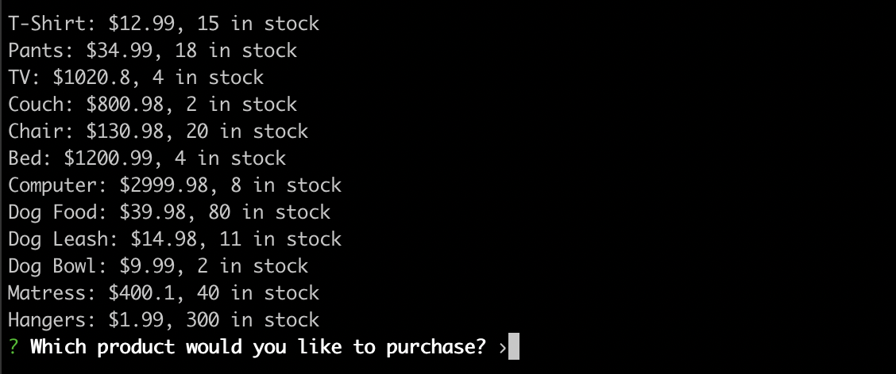

# bamazon

Bamazon is a command-line interface for a digital storefront. It is a basic implementation of a mysql backend, for demonstration purposes.

## Setup

### Project Setup

To begin with bamazon clone this repository, then navigate to the project folder.

```shell
git clone https://github.com/vshimpi100/bamazon.git
cd bamazon
```

Install the node dependencies for bamazon.

```shell
npm install
```

### SQL Setup

#### Database Creation

To create your database, copy and paste the contents of the schema.sql file into your sql client. These files use MySQL, so MySQL Workbench would be appropriate. Run the SQL query to create the bamazon database.

#### Database Seeding

If you want to seed the database with initial data, you can copy and paste the contents of seeds.sql into your sql client. Run the query to push some example products into the database.

#### Connection Settings

You will need an active SQL connection to use bamazon. The settings for your SQL connection can be found in connection.js.

If you are using a local SQL server, you can use settings as below:

```js
export default mysql.createConnection({
    host: "localhost",
    port: 3306,
    user: "root",
    password: [Your password]
    database: "bamazon"
});
```

If you are using an online database or other database, you will need to set up the host and port settings per your provider.

### Running bamazon

To run bamazon, navigate to the project directory and run the base node files.

For the customer CLI:

```shell
node bamazonCustomer.js
```

For the manager CLI:

```shell
node bamazonManager.js
```

## Customer CLI

Upon loading the customer CLI, you will be prompted as below:



Select your product to purchase and enter the quantity to complete your order.


## Manager CLI

Upon loading the manager CLI, you will be prompted as below:


To start with, you can load products for sale to view current inventory or select to view items with low inventory. These selections will return a list of items.


From the manager portal you can also add inventory or new products.

### Adding Inventory

To add inventory, select the add inventory option.


You will then be prompted which item you would like to add inventory to. Select from the list of current items.


Once your item is selected, choose the quantity of that item to add.


You will see returned the list of inventory with your item updated.

### Adding Products

To add a product, select the add product option.


You will first be prompted to input the name of the new product.


You will then be prompted to input the department the product is related to.


You will also be prompted for the product price.


And quantity.


Once completed, you will see the list of all inventory including your new item.